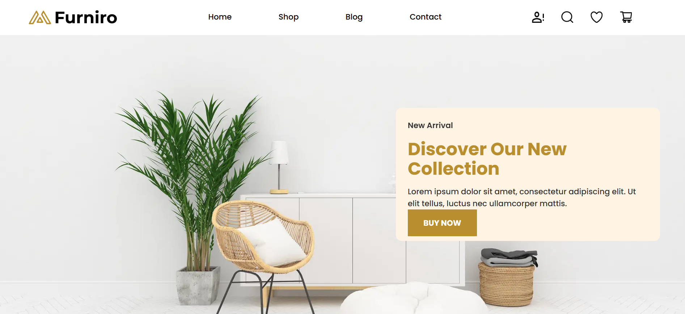
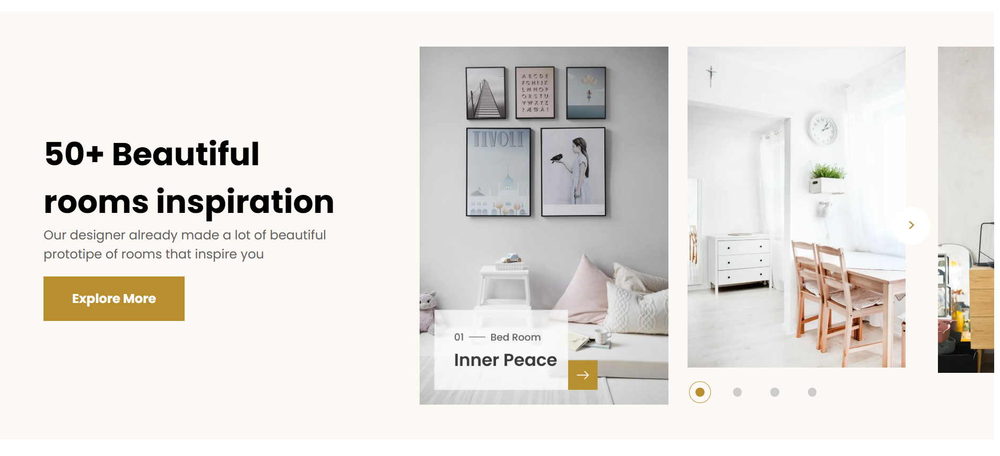

  

# 💫 Mariyam Asif:

**`Building Thoughtful Digital Experiences`**

I am a Frontend Developer who enjoys turning ideas into fast, accessible, and scalable web applications with Next.js, React, and TypeScript. My work combines clean engineering, thoughtful user experiences, and performance-focused development, while I continue expanding into Agentic AI Systems Development and intelligent software systems.

  

---

### Languages and Tools:
            

---

### Featured Projects:

<table>
<tr>
<td width="50%" valign="center" align="center">

### Pixel-Perfect eCommerce Platform

Production-ready eCommerce storefront built with Next.js and TypeScript, achieving a **95+ Lighthouse Performance Score**.

<a href="LIVE_DEMO_LINK">🌐 Live Demo</a> •
<a href="SOURCE_CODE_LINK">💻 Source Code</a>

</td>

<td width="50%" align="center">

### Scalable Marketplace Platform

CMS-driven marketplace built with Next.js and Sanity CMS, enabling non-technical content management.

<a href="LIVE_DEMO_LINK">🌐 Live Demo</a> •
<a href="SOURCE_CODE_LINK">💻 Source Code</a>

</td>
</tr>
</table>

# 📊 GitHub Stats:
 
 

